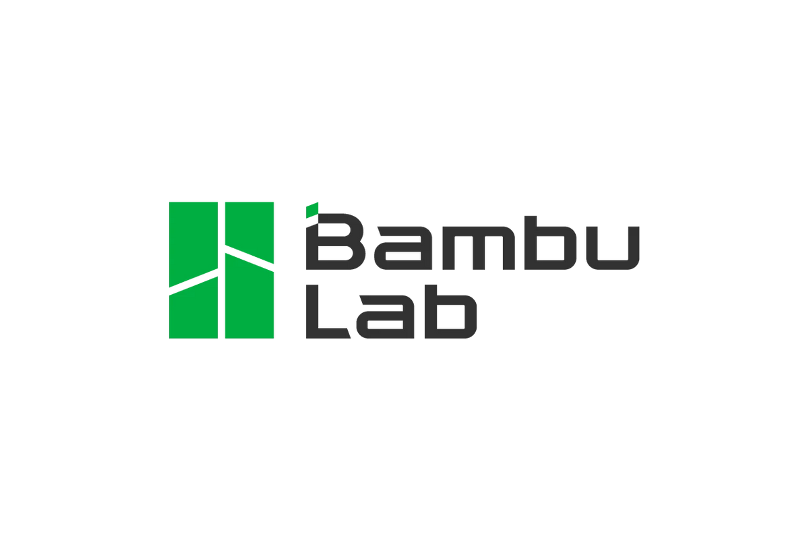

# ioBroker.bambulab

**Tests:** 

## Bambulab 3D-Printing adapter for ioBroker

## Getting started

With credits to [kmxak](https://forum.iobroker.net/user/kmxak), [djalexz](https://forum.iobroker.net/user/djalexz), all other involved and inspired by [this forum thread](https://forum.iobroker.net/topic/61585/bambu-lab-3d-drucker-mqtt-integration)
this adapter integrates Bambulab 3D-Printers into ioBroker.

Please provide your API token & serial number in adapter settings, these are required for a local connection (no cloud involved) to your printer.
These credentials are stored locally and not shared to third parties.

Serial API-Token & Serial number can be found in printer setting on your printer display

## Changelog
<!--
	Placeholder for the next version (at the beginning of the line):
	### **WORK IN PROGRESS**
-->

### **WORK IN PROGRESS** - Minor improvements
* (DutchmanNL) Translations added
* (DutchmanNL) Minor code improvements
* (DutchmanNL) Control states implemented
* (DutchmanNL) Test & release workflows updated
* (DutchmanNL) Encryption of token and device serial improved

### 0.1.0 initial release
* (DutchmanNL) initial release
* During startup adapter throws warnings, these can be ignored and will be solved in >= 0.1.1
* Control start/stop/resume and light available available in >= 0.1.1

## License
MIT License

Copyright (c) 2023 DutchmanNL <oss@drozmotix.eu>

Permission is hereby granted, free of charge, to any person obtaining a copy
of this software and associated documentation files (the "Software"), to deal
in the Software without restriction, including without limitation the rights
to use, copy, modify, merge, publish, distribute, sublicense, and/or sell
copies of the Software, and to permit persons to whom the Software is
furnished to do so, subject to the following conditions:

The above copyright notice and this permission notice shall be included in all
copies or substantial portions of the Software.

THE SOFTWARE IS PROVIDED "AS IS", WITHOUT WARRANTY OF ANY KIND, EXPRESS OR
IMPLIED, INCLUDING BUT NOT LIMITED TO THE WARRANTIES OF MERCHANTABILITY,
FITNESS FOR A PARTICULAR PURPOSE AND NONINFRINGEMENT. IN NO EVENT SHALL THE
AUTHORS OR COPYRIGHT HOLDERS BE LIABLE FOR ANY CLAIM, DAMAGES OR OTHER
LIABILITY, WHETHER IN AN ACTION OF CONTRACT, TORT OR OTHERWISE, ARISING FROM,
OUT OF OR IN CONNECTION WITH THE SOFTWARE OR THE USE OR OTHER DEALINGS IN THE
SOFTWARE.